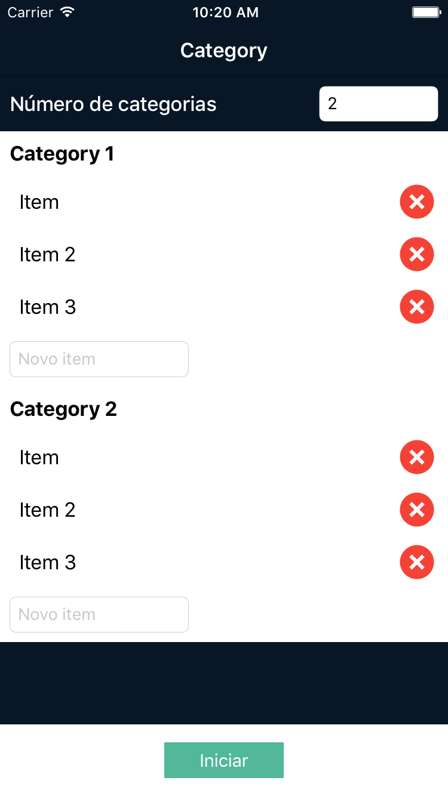
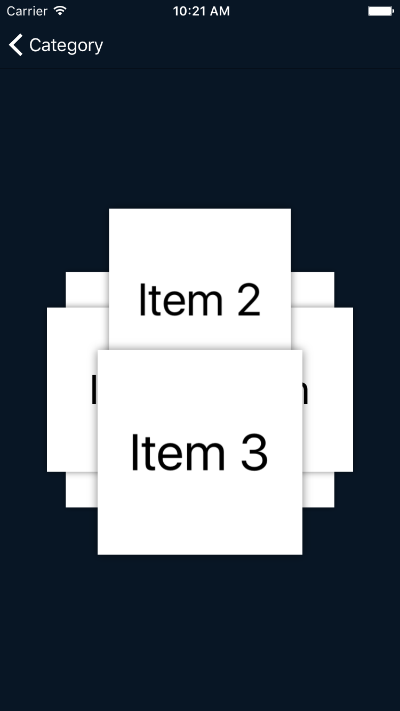
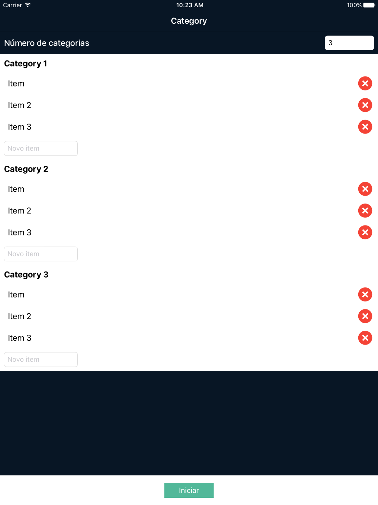
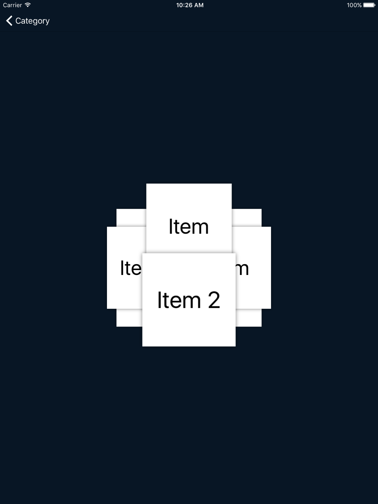

# Zup Challenge iOS

Zup Challenge for iOS Platform with auto layout

**This app uses:**
+ [iCarousel](https://github.com/nicklockwood/iCarousel) is a class designed to simplify the implementation of various types of carousel (paged, scrolling views) on iPhone, iPad and Mac OS.
+ [Cocoapods](https://developer.apple.com/library/ios/referencelibrary/GettingStarted/DevelopiOSAppsSwift/Lesson5.html) CocoaPods manages dependencies for Xcode projects.

**iPhone**

**iPad**

